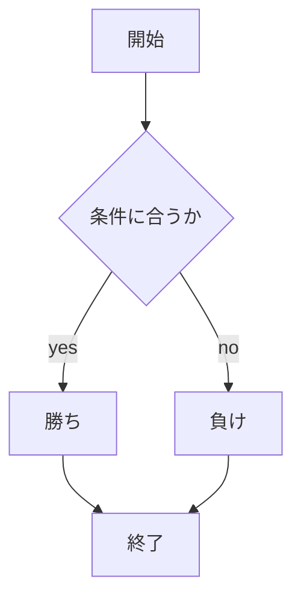
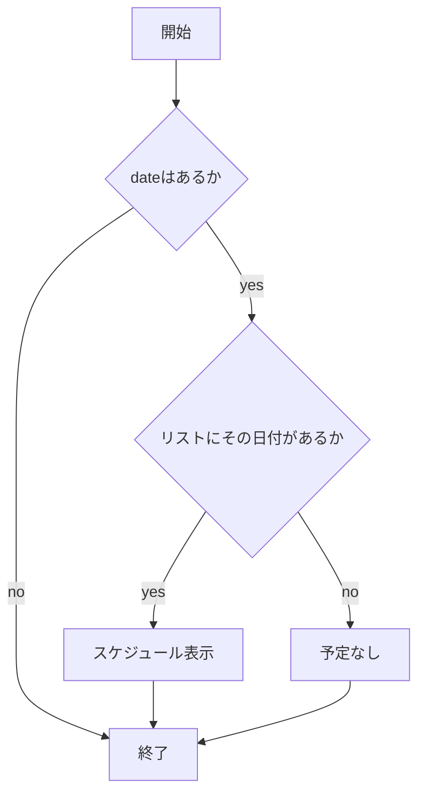
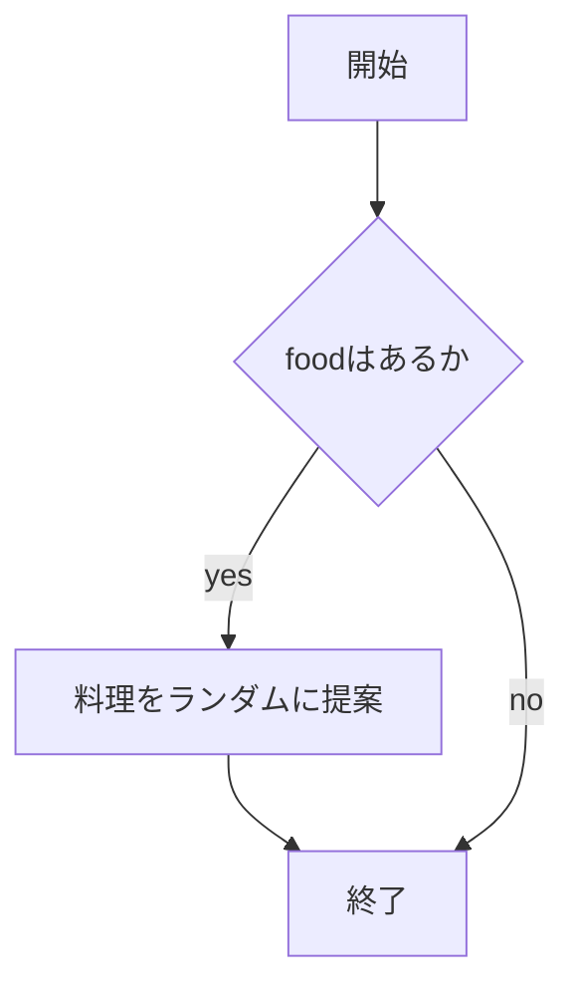

# webpro_06
2024.11.17

## app5.jsのドキュメント

app5.js...具体的なテンプレートに基づく本体のプログラムが記されたファイル．
### 各アプリの機能一覧

アプリケーション | 機能
-|-
\hello1 | 2種類の挨拶を表示
\hello2 | 2種類の挨拶を表示
\icon | appleのロゴを表示
\luck | 今日の運勢を表示
\janken | cpuとのじゃんけんを行う
\date | 各日付のスケジュール検索が可能
\food | 主食に対する料理の提案


### \hello1の利用手順と出力結果
1. ```app5.js``` を起動する．
1. Webブラウザでlocalhost:8080/hello1にアクセスする．

結果:Massage1とMassage2という変数にHello World と Bon Jour が出力され表示される．

### \hello2の利用手順と出力結果
1. ```app5.js``` を起動する．
1. Webブラウザでlocalhost:8080/hello2にアクセスする．

結果:直接Hello World と Bon Jour が出力され表示される．

### \iconの利用手順と出力結果
1. ```app5.js``` を起動する．
1. Webブラウザでlocalhost:8080/iconにアクセスする．

結果:appleのロゴが表示される．

### luckの利用手順と出力結果
1. ```app5.js``` を起動する．
1. Webブラウザでlocalhost:8080/iconにアクセスする．

結果:ランダムで選ばれるデバック数と，その数に対応した「大吉，中吉，小吉，大大吉，凶，普通吉」が運勢として表示される．

### \jankenの利用手順と出力結果
1. ```app5.js``` を起動する．
1. Webブラウザでlocalhost:8080/iconにアクセスする．
1.自分の手を入力する．

結果:勝敗を判定し，全試合中の勝利数が表示される．

##### プログラムの流れ


### \dateの利用手順と出力結果
1. ```app5.js``` を起動する．
1. Webブラウザでlocalhost:8080/iconにアクセスする．
1. スケジュールが知りたい日付を選択する．

結果:日付に対応したスケジュールが表示される．

##### プログラムの流れ


### \foodの利用手順と出力結果
1. ```app5.js``` を起動する．
1. Webブラウザでlocalhost:8080/iconにアクセスする．
1. 3つの主食から1つを選択する．

結果:主食に対応した料理がランダムに表示される．

##### プログラムの流れ



