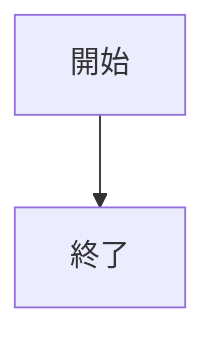
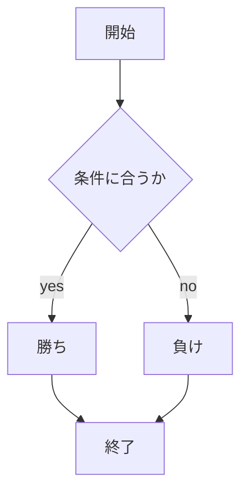

# webpro_06
2024.10.29

## このプログラムについて
## ファイル一覧

ファイル名 | 説明
-|-
app5.js | プログラム本体
public/janken.html | じゃんけんの開始画面
views/janken.ejs | 具体的なテンプレート

## ソースコード
```javascript
console.log('hello');
```

## app.jsの利用手順
1. ```app5.js``` を起動する
1. Webブラウザでlocalhost:8080/public/janken.htmlにアクセスする
1. 自分の手を入力する

## 図の描画




